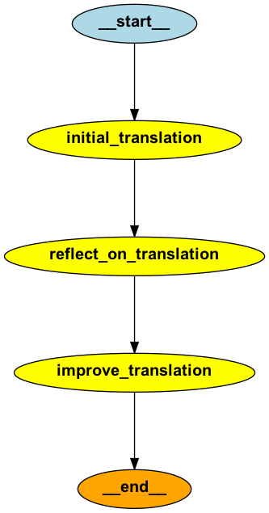

# 基于LangGraph的翻译工作流实现

## 项目简介
本项目是基于吴恩达(Andrew Ng)博士的翻译工作流程设计进行的复现和改进。使用LangGraph框架替代原有工作流实现了一个完整的翻译系统，该系统不仅能完成基础翻译，还包含了翻译质量反思和改进的功能。

本项目参考了以下资源：
- 原始代码仓库：(https://github.com/andrewyng/translation-agent)

## 核心特性
- 🔄 完整的翻译-反思-改进工作流
- 🌍 多语言支持与文化适应
- 📊 工作流程可视化
- 🤖 基于大模型的智能翻译
- 📝 详细的翻译质量反馈

## 技术架构
- LangGraph：工作流框架
- DeepSeek：底层语言模型
- Graphviz：工作流可视化
- Python 3.x：开发语言

## 运行效果
### 工作流程图


### 翻译示例
```plaintext
[初次翻译的结果]：
{翻译结果示例}

[反思后的建议结果]：
{改进建议示例}

[改进后的翻译结果]：
{最终翻译示例}
```

## 快速开始

### 环境准备
```bash
# 安装依赖
pip install langgraph openai pygraphviz

# Mac系统需要安装graphviz
brew install graphviz

# Linux系统安装graphviz
sudo apt-get install graphviz  # Ubuntu/Debian
sudo yum install graphviz      # CentOS/RHEL
```

### 配置说明
1. 修改模型配置（translate.py）：
```python
deep_seek_url = "your_api_url"
deep_seek_api_key = "your_api_key"
```

2. 运行程序：
```bash
python translate.py
```

## 工作流程详解
1. **初始翻译**
   - 输入：源语言文本
   - 输出：初步翻译结果
   - 过程：使用DeepSeek模型进行基础翻译

2. **翻译反思**
   - 输入：源文本 + 初始翻译
   - 输出：改进建议
   - 评估维度：准确性、流畅性、风格、术语使用

3. **翻译改进**
   - 输入：初始翻译 + 改进建议
   - 输出：优化后的翻译
   - 特点：综合考虑语言特点和文化背景

## 项目结构
```
.
├── README.md          # 项目说明文档
├── translate.py       # 核心实现代码
├── requirements.txt   # 项目依赖
└── translate_workflow.png  # 工作流程图
```

## 注意事项
- 确保已正确配置API密钥
- 翻译大型文本时注意API限制
- graphviz需要系统层面安装